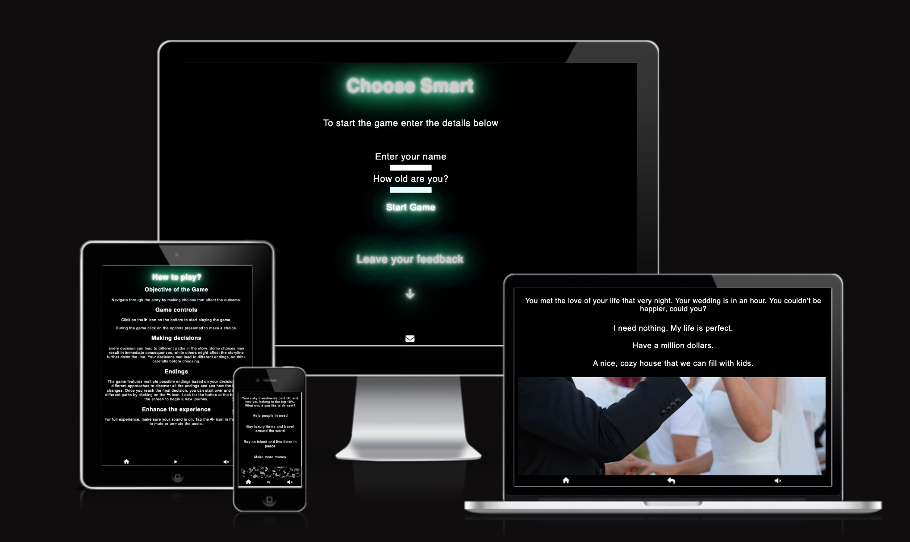

# Choose Smart

Choose Smart is a responsive website that allows users to view it on range of devices. 
It is a decision-based game where every choice the user makes influences the story and its outcome. 
Users making critical decisions that shape the narrative, leading to multiple possible endings. 
Choose Smart offers a unique experience where your decisions truly matter.

[View Choose Smart on Github Pages](https://tamas-gavlider.github.io/choose-smart/)

## Contents

## User Experience (UX)

### User Stories

#### First Time Visitor Goals

#### Returning Visitor Goals

#### Frequent Visitor Goals

## Design

### Colour Scheme

### Wireframe

Wireframes were created for mobile, tablet and desktop.

Index page:
[Mobile](/docs/wireframe/index-mobile.png) 
[Tablet](/docs/wireframe/index-tablet.png) 
[Desktop](/docs/wireframe/index-browser.png) 
Index page after the Start Game button pressed:
[Mobile](/docs/wireframe/index-after-details-mobile.png) 
[Tablet](/docs/wireframe/index-after-details-tablet.png) 
[Desktop](/docs/wireframe/index-after-details-desktop.png) 
Instructions page:
[Mobile](/docs/wireframe/instructions-mobile.png) 
[Tablet](/docs/wireframe/instructions-tablet.png) 
[Desktop](/docs/wireframe/instructions-desktop.png) 
Game page:
[Mobile](/docs/wireframe/game-mobile.png) 
[Tablet](/docs/wireframe/game-tablet.png) 
[Desktop](/docs/wireframe/game-desktop.png)

### Typography

### Imagery

### Features

## Technologies used

### Languages used

HTML,CSS and JavaScript were used to create this website.

### Frameworks, Libraries & Programs Used

Git - for Version Control.

Github - To save and store the files for the website.

Google Fonts - To import the fonts used on the website.

Balsamiq - Used to create wireframes.

Font Awesome - Used for icon and logo images.

Google Dev Tools - To troubleshoot and test features, solve issues with responsiveness and styling.

[Am I Responsive](https://ui.dev/amiresponsive) To show the website image on a range of devices.

[Favicon](https://favicon.io/favicon-converter/#google_vignette) - To create Favicon.

[Pixabay](https://pixabay.com/) - Used to donwload audio and video. 

## Deployment & Local Development

### Deployment

Github Pages was used to deploy the live website. The instructions to achieve this are below:

1. Log in (or sign up) to Github.
1. Find the repository for this project, choose-smart.
1. Click on the Settings link.
1. Click on the Pages link in the left hand side navigation bar under "Code and Automation".
1. In the Source section, choose main from the drop down select branch menu. Select Root from the drop down select folder menu.
1. Click Save. Your live Github Pages site is now deployed at the URL shown.

### Local Development

How to Fork

To fork the choose-smart repository:

1. Log in (or sign up) to Github.
1. Go to the repository for this project, Tamas-Gavlider/The-Hunger-Gamers.
1. Click the Fork button in the top right corner.

### How to Clone

To clone the The-Hunger-Gamers repository:

1. Log in (or sign up) to Github.
1. Go to the repository for this project, Tamas-Gavlider/choose-smart.
1. Click on the code button, select whether you would like to clone with HTTPS, SSH or GitHub CLI and copy the link shown.
1. Open the terminal in your code editor and change the current working directory to the location you want to use for the cloned directory.
1. Type 'git clone' into the terminal and then paste the link you copied in step 3. Press enter.

### Testing

I have used Chrome Developer tool while building the web page and troubleshoot any issues immediately.

The following issues were raised during my mid project meeting with my mentor:

 - The source code contained too many unnecessary whitespaces and lack of comments.
 - Move the game data into a new js file and import it into the main js file 

### Known Bugs

### W3C Validator

The [W3C](https://validator.w3.org/) validator was used to validate the HTML on all pages of the website. It was also used to validate CSS in the style.css file.

[index.html](/docs/testing/validator/w3c-index.png) 
[instructions.html](/docs/testing/validator/w3c-instructions.png) 
[game.html](/docs/testing/validator/w3c-game.png) 
[style.css](/docs/testing/validator/css-validation.png)

### JavaScript Validator

[jshint](https://jshint.com/) was used to validate the JavaScript files.

[main.js](/docs/testing/validator/main-js-test.png) 
[audio.js](/docs/testing/validator/audio-js-test.png) 
[start.js](/docs/testing/validator/start-js-test.png) 
[data.js](/docs/testing/validator/data-js-test.png)

### Lighthouse

I used Lighthouse within the Chrome Developer Tools to test the performance, accessibility, best practices and SEO of the website.

### Wave

All 3 pages were tested at [Wave](https://wave.webaim.org/).

### Full Testing

I performed the following testing using a number of browsers (google chrome, safari, mozilla firefox,edge) and devices (Macbook Pro 15 inch, iMac 21.5 inch, iPhone 11, iPhone 6s and a 15 inch Dell laptop).
I also used Google Chrome Developer Tools to ensure that each page is responsive on different screen sizes.

## Credits 

### Media

All the video and audio files were downloaded from [Pixabay](https://pixabay.com/). 
All screenshots used in this README file were taken by myself.

### Content

All content for the website was written by Tamas Gavlider. 
The blinking text effect code in CSS was found at [Stack Overflow](https://stackoverflow.com/questions/16344354/how-to-make-blinking-flashing-text-with-css-3.). 
The neon effect code was found at [CSS-tricks.com](https://css-tricks.com/how-to-create-neon-text-with-css/).
